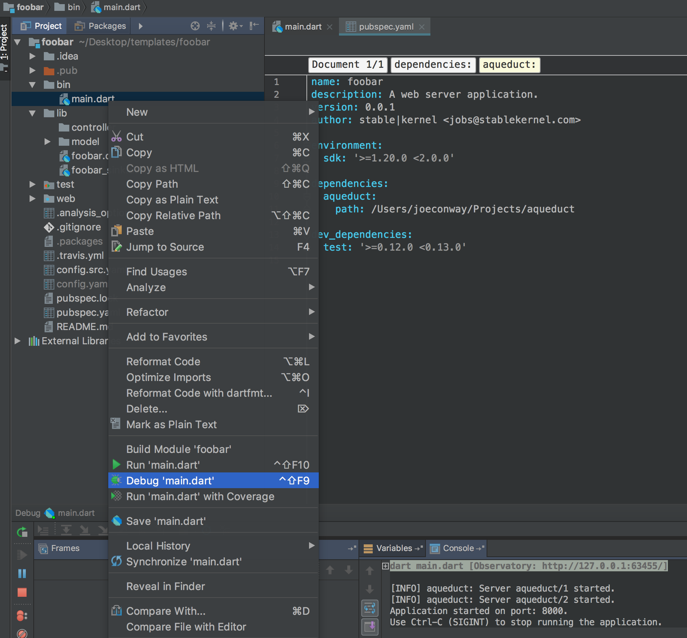
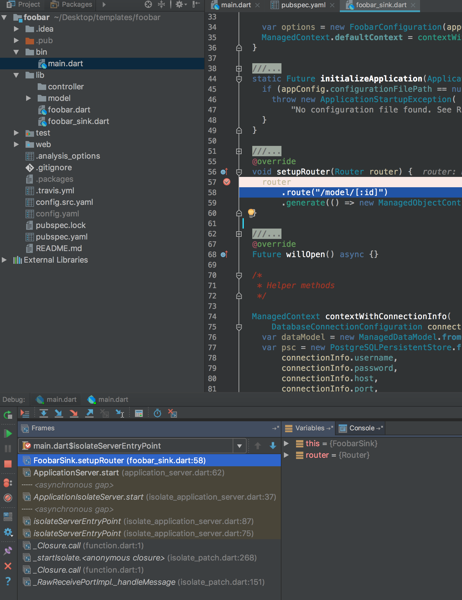

# Debugging Conduit Applications

The debugger may be used when running tests or developing client applications locally.

## Enabling the Debugger

Applications created by `conduit create` ship with a `bin/main.dart` script that starts the application. When developing, running this script from an IDE is often preferred to `conduit serve` because the IDE can leverage its full capabilities. One such capability is a debugger. In IntelliJ IDEA \(and its suite of products\), you may right-click on this file and select 'Debug' from the pop-up menu to run the application in the debugger.



## Setting Breakpoints

A valuable feature of a debugger is the ability to set breakpoints. A breakpoint pauses execution of your application at a specific point in the code, allowing you to view variable values and monitor the code path line-by-line as execution continues.

To set a breakpoint, you simply click on the gutter area next to the line of code you wish to stop at.



Once a debugger stops, you can view variable values in the center pane of the debugging panel. The left pane \(labeled 'Frames'\) shows the current stack trace. The row of buttons above the stack trace allow you to continue executing code line-by-line.

Each button in this row has a slightly different behavior. From left to right:

* The red arrow with the stack of lines continues execution until the next breakpoint is encountered.
* The blue downwards arrow executes the current line and moves to the next line.
* The blue right/downward arrow continues execution into the function that is about to be called and stops on its first line.
* The red right/downward arrow is the same as above, but will also jump into dependency code.
* The blue right/upwards arrow completes execution of the current method and stops right after the callsite.

Note that currently asynchronous invocations confuse the debugger a bit. To continue past an asynchronous method to the next line, set a breakpoint on that next line and hit the big green arrow on the left column of buttons.

To jump into an asynchronous method, command-click on its definition and set a breakpoint on its first line and then click the big green arrow.

## Profiling with Observatory

You may also use [Observatory](https://dart-lang.github.io/observatory/) to profile applications. Profiling consists of monitoring memory usage, allocations and how much time a function spends executing relative to the rest of your application.

Both `conduit serve` and `bin/main.dart` support starting Observatory. When running the application with `conduit serve`, add the `--observe` flag and Observatory will start listening on port 8181 and a web browser will automatically be opened.

```text
conduit serve --observe
```

When running the application through IntelliJ, Observatory will start listening on a random port. In the run console in IntelliJ, you may click on the Observatory hyperlink to open it in your web browser.

